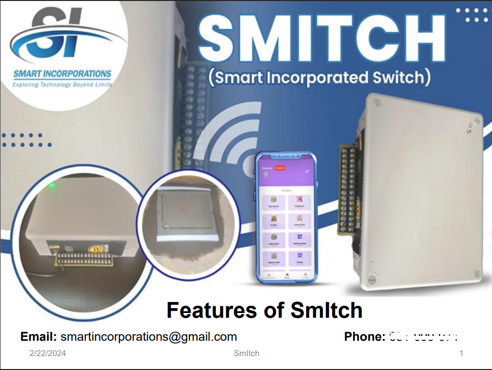
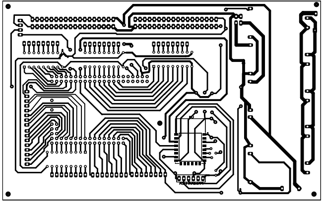
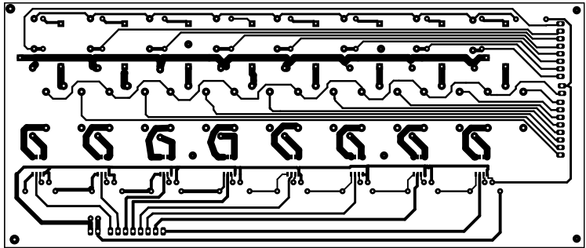
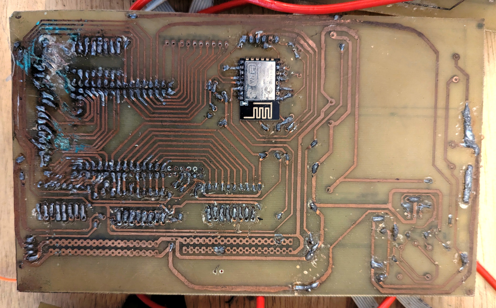

# SmItch – Smart Incorporated Switch

SmItch is a home automation device designed to make everyday living easier and safer.  
Its core algorithm runs offline, meaning it does not depend on constant internet connection.

## Features
- Control appliances from anywhere in the world
- Offline scheduling with RTC
- Electricity state notifications
- Safe start‑up to protect appliances from surge power
- Durable push‑button switches (low DC, no electrocution risk)
- Emergency alerts with sounder and online trigger
- Expandability up to 96 devices (lamps + sockets)
- User‑friendly Android app (compatible down to version 4)

## Hardware Architecture
- **Core Controller**: Arduino Mega Pro Mini  
- **Connectivity**: ESP8266 module for internet access  
- **Timekeeping**: Real Time Clock (RTC) for offline schedules  
- **Drivers**: ULN2803 ICs for relay control  
- **Relays**: 12V relays to prevent fast voltage dropouts  
- **Power Supply**: Hi‑Link modules were used as the main supply, found to be stable and reliable  
- **Backup Power**: Inbuilt battery allowed the system to stay alive briefly after electricity went down, ensuring it could notify the user first or ride through small blinks  

## Software Architecture
- **Backend**: Firebase  
  Used for authentication, database storage, and cloud synchronization.  
  Enables secure communication between hardware and mobile app.  

- **Mobile Application**: Flutter (outsourced)
  Built with Flutter for cross‑platform compatibility.  
  Provides a user‑friendly interface with enlarged control buttons and smooth integration with Firebase.  

- **Hybrid Operation**:  
  While Firebase enables global monitoring and control, SmItch’s core algorithm runs offline.  
  This ensures schedules, switch disabling, and safe start features continue to work even without internet connectivity.

## Project Flyer

## PCB Examples

## Documentation
See `/Docs_System/Features_of_SmItch.pdf` for the complete feature list and scenarios.

## PCB Challenges
During local PCB realization at this scale, several issues were encountered:
- Copper lines were not fully formed due to **partial etching**, leading to broken traces.  
- Many connections had to be **modified manually after realization** to restore continuity.  
- Over time, some lines would still cut, showing that the links were not mechanically strong enough.  
- These challenges highlighted the difficulty of locally fabricating high‑current PCBs and taught valuable lessons about robust design and manufacturing processes.
- wven with good skills in local PCB, we still had to get to this, though the picture below is that of a board that made 1 year 8 months in the field, but it was not looking good

## Boards (1 year 8 months in use)

## Firmware Versions
- **Arduino_code** → Original Mega Pro Mini firmware  
- **smitch_esp_code_version2** → ESP8266 firmware with internet control  

## License
MIT License

---

**Note:** This repository contains simplified firmware and documentation for demonstration purposes.  
**It is not the final production firmware. The complete project remains confidential and non‑disclosable.**  
**What is shared here represents a basic working version to illustrate the concept and core features of SmItch.**
