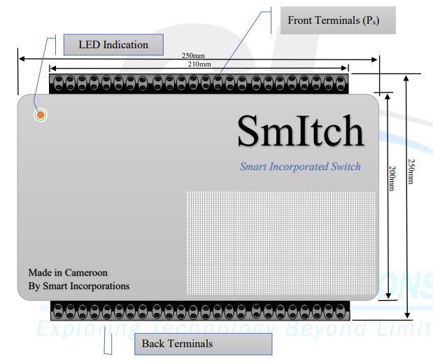
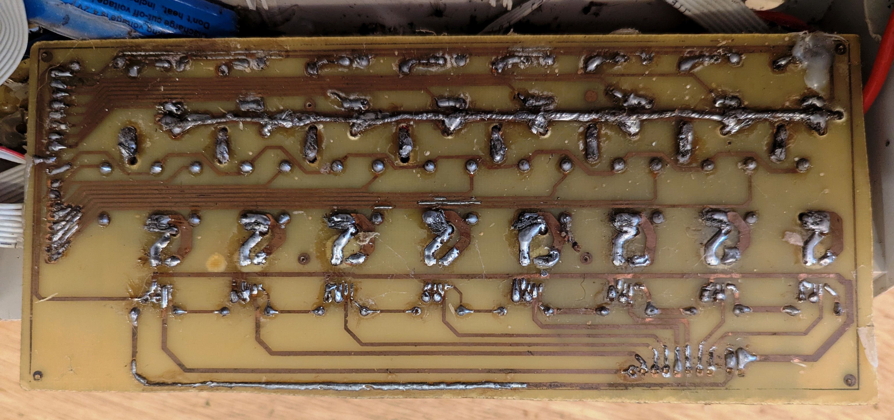

# SmItch – Smart Incorporated Switch

SmItch is a home automation device designed to make everyday living easier and safer.  
Its core algorithm runs offline, meaning it does not depend on constant internet connection.

## Features
- Control appliances from anywhere in the world
- Offline scheduling with RTC
- Electricity state notifications
- Safe start‑up to protect appliances from surge power
- Durable push‑button switches (low DC, no electrocution risk)
- Emergency alerts with sounder and online trigger
- Expandability up to 96 devices (lamps + sockets)
- User‑friendly Android app (compatible down to version 4)

## Hardware Architecture
- **Core Controller**: Arduino Mega Pro Mini  
- **Connectivity**: ESP8266 module for internet access  
- **Timekeeping**: Real Time Clock (RTC) for offline schedules  
- **Drivers**: ULN2803 ICs for relay control  
- **Relays**: 12V relays to prevent fast voltage dropouts  
- **Power Supply**: Hi‑Link modules were used as the main supply, found to be stable and reliable  
- **Backup Power**: Inbuilt battery allowed the system to stay alive briefly after electricity went down, ensuring it could notify the user first or ride through small blinks  

## Software Architecture
- **Backend**: Firebase  
  Used for authentication, database storage, and cloud synchronization.  
  Enables secure communication between hardware and mobile app.  

- **Mobile Application**: Flutter (outsourced)  
  Built with Flutter for cross‑platform compatibility.  
  Provides a user‑friendly interface with enlarged control buttons and smooth integration with Firebase.  

- **Hybrid Operation**:  
  While Firebase enables global monitoring and control, SmItch’s core algorithm runs offline.  
  This ensures schedules, switch disabling, and safe start features continue to work even without internet connectivity.

## Project Flyer

  

## interfacing

  

  

## PCB Examples

  

  

## Documentation
See `/Docs_System/Features_of_SmItch.pdf` for the complete feature list and scenarios.

## PCB Challenges
During local PCB realization at this scale, several issues were encountered:
- Copper lines were not fully formed due to **partial etching**, leading to broken traces.  
- Many connections had to be **modified manually after realization** to restore continuity.  
- Over time, some lines would still cut, showing that the links were not mechanically strong enough.  
- These challenges highlighted the difficulty of locally fabricating high‑current PCBs and taught valuable lessons about robust design and manufacturing processes.  
- Even with good skills in local PCB, we still faced these limitations. The picture below shows a board that lasted 1 year 8 months in the field, but its condition revealed the need for stronger fabrication methods.

## Boards (1 year 8 months in use)

  

  

  

## Lessons Learned
From the field installations and PCB realization process, several key lessons emerged:

- **Proper PCB Fabrication**: Locally realized PCBs at this scale faced durability issues.  
  For a lasting real‑world project, PCBs must be printed using proper industrial methods with stronger copper thickness.

- **System Size and Integration**: The initial units were relatively large.  
  To install in two homes, we had to rewire and bring everything to the distribution box.  
  This highlighted the importance of making the unit smaller and more modular for easier integration.

- **Power Reliability**: Using Hi‑Link modules provided stable supply, and the inbuilt battery allowed the system to survive short outages or blinks.  
  This combination proved essential for reliable operation in real environments.

- **Path to Further Development**: These challenges and experiences led to improvements and the evolution of SmItch into a broader **energy management solution**, designed for better scalability and long‑term use.

## Firmware Versions
- **Arduino_code** → Original Mega Pro Mini firmware  
- **smitch_esp_code_version2** → ESP8266 firmware with internet control  

## License
MIT License

---

**Note:** This repository contains simplified firmware and documentation for demonstration purposes.  
**It is not the final production firmware. The complete project remains confidential and non‑disclosable.**  
**What is shared here represents a basic working version to illustrate the concept and core features of SmItch.**
